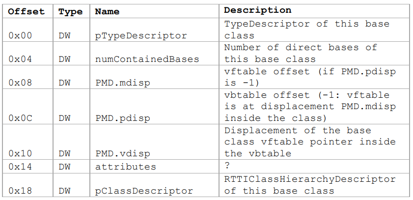
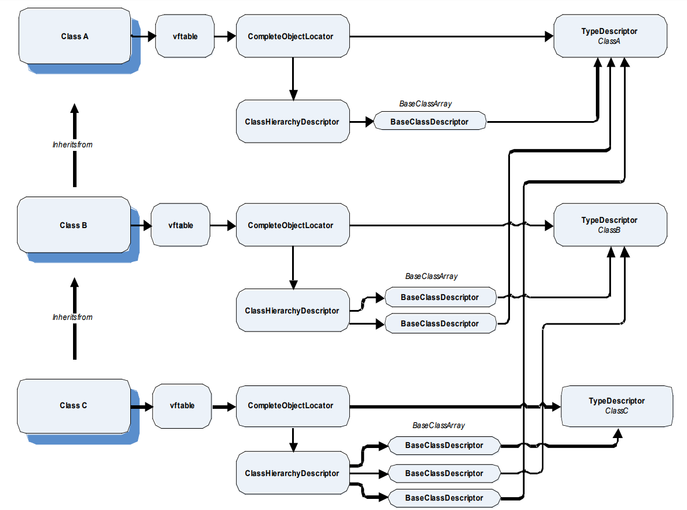
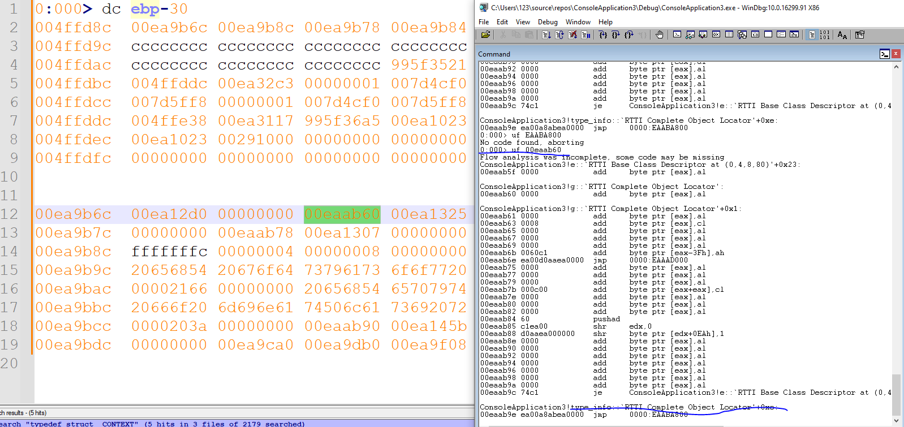
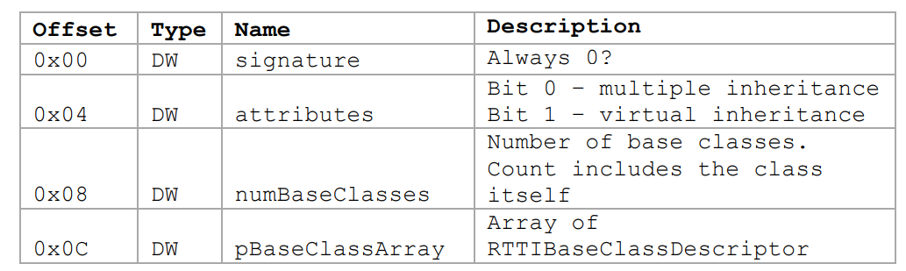
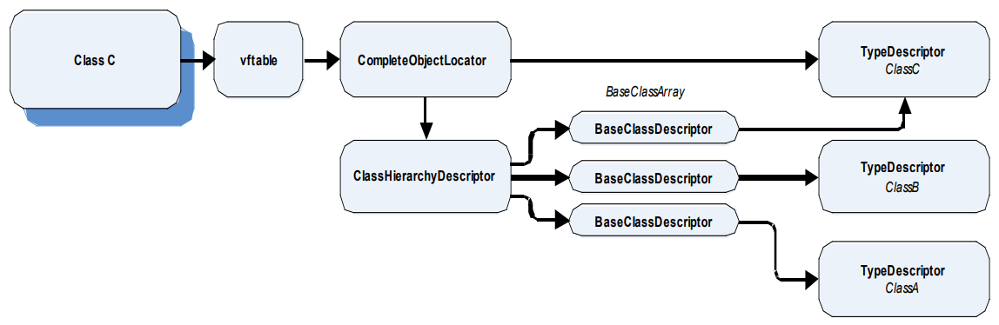

大半夜睡不着觉，看会儿文章

https://www.blackhat.com/presentations/bh-dc-07/Sabanal_Yason/Paper/bh-dc-07-Sabanal_Yason-WP.pdf


文中提到关于C++的汇编代码的特征识别，其中一个就是可以看到大量的ecx寄存器的使用

[示例代码](https://github.com/wqreytuk/C-_reversing/blob/main/exmaple_code/code_1.cpp)


可以看到，在两次test函数中间，出现了两个call指令，但是源代码中只有一个new对象的操作，关于这个地方的解释就是第一个call是new关键字发起的调用，
第二个call是对象的构造函数的调用

可以看到在第二个call调用中，ecx的值是dword ptr [ebp-338h]，正是第一次调用返回之后eax的值存储到的位置

这里的ecx其实就是this指针

# C++类的内存布局

包含有虚函数的类的内存布局

[示例代码](https://github.com/wqreytuk/C-_reversing/blob/main/exmaple_code/code_2.cpp)


`00f65e30`为new操作返回的地址值，就是ex2类在内存中的地址

```
0:000> dc eax
00f65e30  00ac7b34 00000000 fdfdfdfd abababab  4{..............
00f65e40  abababab feeefeee 00000000 00000000  ................
00f65e50  2ff15af0 0000e109 00f65c60 00f6bfb8  .Z./....`\......
00f65e60  feeefeee feeefeee feeefeee feeefeee  ................
00f65e70  feeefeee feeefeee feeefeee feeefeee  ................
00f65e80  feeefeee feeefeee feeefeee feeefeee  ................
00f65e90  feeefeee feeefeee feeefeee feeefeee  ................
00f65ea0  feeefeee feeefeee 3ff25ae3 1800e10b  .........Z.?....
```

`00ac7b34`是vftable的地址，`00000000`是成员变量var1

```
0:000> dc poi(eax)
00ac7b34  00ac12d0 00ac1046 00000000 74736574  ....F.......test
00ac7b44  0000000a 00ac8b24 00ac1447 00000000  ....$...G.......
00ac7b54  00ac8b7c 00ac13c5 00ac1127 00000000  |.......'.......
00ac7b64  6e6b6e55 206e776f 65637865 6f697470  Unknown exceptio
00ac7b74  0000006e 00000000 00ac8bd4 00ac10ff  n...............
00ac7b84  00ac1127 00000000 20646162 6f6c6c61  '.......bad allo
00ac7b94  69746163 00006e6f 00000000 00ac8c30  cation......0...
00ac7ba4  00ac10a0 00ac1127 00000000 20646162  ....'.......bad 
```

`00ac12d0`和`00ac1046`是ex2类的两个虚函数的地址

```
0:000> uf poi(poi(eax))
client!ex2::get_sum [C:\Users\x\source\repos\udp\client\client.cpp @ 22]:
   22 00ac1900 55              push    ebp
   22 00ac1901 8bec            mov     ebp,esp
   22 00ac1903 81eccc000000    sub     esp,0CCh
   22 00ac1909 53              push    ebx
   22 00ac190a 56              push    esi
   22 00ac190b 57              push    edi
   22 00ac190c 51              push    ecx
   22 00ac190d 8d7df4          lea     edi,[ebp-0Ch]
   22 00ac1910 b903000000      mov     ecx,3
   22 00ac1915 b8cccccccc      mov     eax,0CCCCCCCCh
   22 00ac191a f3ab            rep stos dword ptr es:[edi]
   22 00ac191c 59              pop     ecx
   22 00ac191d 894df8          mov     dword ptr [ebp-8],ecx
15732480 00ac1920 b908c0ac00      mov     ecx,offset client!_NULL_IMPORT_DESCRIPTOR <PERF> (client+0x1c008) (00acc008)
15732480 00ac1925 e882faffff      call    client!ILT+935(__CheckForDebuggerJustMyCode (00ac13ac)
   23 00ac192a 8b4508          mov     eax,dword ptr [ebp+8]
   23 00ac192d 03450c          add     eax,dword ptr [ebp+0Ch]
   24 00ac1930 5f              pop     edi
   24 00ac1931 5e              pop     esi
   24 00ac1932 5b              pop     ebx
   24 00ac1933 81c4cc000000    add     esp,0CCh
   24 00ac1939 3bec            cmp     ebp,esp
   24 00ac193b e86df9ffff      call    client!ILT+680(__RTC_CheckEsp) (00ac12ad)
   24 00ac1940 8be5            mov     esp,ebp
   24 00ac1942 5d              pop     ebp
   24 00ac1943 c20800          ret     8

client!ILT+715(?get_sumex2UAEHHHZ):
00ac12d0 e92b060000      jmp     client!ex2::get_sum (00ac1900)  Branch
```

```
0:000> uf poi(poi(eax)+4)
client!ex2::reset_value [C:\Users\x\source\repos\udp\client\client.cpp @ 26]:
   26 00ac19c0 55              push    ebp
   26 00ac19c1 8bec            mov     ebp,esp
   26 00ac19c3 81eccc000000    sub     esp,0CCh
   26 00ac19c9 53              push    ebx
   26 00ac19ca 56              push    esi
   26 00ac19cb 57              push    edi
   26 00ac19cc 51              push    ecx
   26 00ac19cd 8d7df4          lea     edi,[ebp-0Ch]
   26 00ac19d0 b903000000      mov     ecx,3
   26 00ac19d5 b8cccccccc      mov     eax,0CCCCCCCCh
   26 00ac19da f3ab            rep stos dword ptr es:[edi]
   26 00ac19dc 59              pop     ecx
   26 00ac19dd 894df8          mov     dword ptr [ebp-8],ecx
15732480 00ac19e0 b908c0ac00      mov     ecx,offset client!_NULL_IMPORT_DESCRIPTOR <PERF> (client+0x1c008) (00acc008)
15732480 00ac19e5 e8c2f9ffff      call    client!ILT+935(__CheckForDebuggerJustMyCode (00ac13ac)
   27 00ac19ea 8b45f8          mov     eax,dword ptr [ebp-8]
   27 00ac19ed c74004d2040000  mov     dword ptr [eax+4],4D2h
   28 00ac19f4 5f              pop     edi
   28 00ac19f5 5e              pop     esi
   28 00ac19f6 5b              pop     ebx
   28 00ac19f7 81c4cc000000    add     esp,0CCh
   28 00ac19fd 3bec            cmp     ebp,esp
   28 00ac19ff e8a9f8ffff      call    client!ILT+680(__RTC_CheckEsp) (00ac12ad)
   28 00ac1a04 8be5            mov     esp,ebp
   28 00ac1a06 5d              pop     ebp
   28 00ac1a07 c3              ret

client!ILT+65(?reset_valueex2UAEXXZ):
00ac1046 e975090000      jmp     client!ex2::reset_value (00ac19c0)  Branch
```

所以我们可以看到ex2类在内存中的布局如下：

```
class ex2:
+-----------------+
| vftable_address |
+-----------------+
| member_var      |
+-----------------+

vftable：
+----------------------+
| virtuable_func1_addr |
+----------------------+
| virtuable_func2_addr |
+----------------------+
```

而对于没有虚函数的类而言，其内存布局就是一堆成员变量按照声明的顺序进行排列，并根最长的据数据类型进行padding，看不到成员函数，从windbg的调试结果来看，成员函数的地址和类的地址并没有什么关系

## 继承类的内存布局

比如下面的继承关系：

```c++
class ex2 {
	int var1;
public:
	virtual int get_sum(int x, int y);
	virtual void reset_value();
};

class ex3 :public ex2 {
	int var1;
public:
	int get_value();
};
```

ex3在内存中的布局如下：


```
class ex3:
+-----------------------------+
| vftable_address_of_ex2      |
+-----------------------------+
| member_var_of_ex2           |
+-----------------------------+
| member_var_of_ex3           |
+-----------------------------+

vftable：
+-----------------------------+
| virtuable_func1_addr_of_ex2 |
+-----------------------------+
| virtuable_func2_addr_of_ex2 |
+-----------------------------+
```

可以看到，只是将ex3中的成员变量拼到下面而已

### 多继承

考虑下面这种情况

```c++
class ex4 {
	int var1;
	int var2;
public:
	virtual int ex4_func1();
	virtual void ex4_func2();
};

int ex4::ex4_func1() {
	return var1;
}

void ex4::ex4_func2() {
	printf("1234");
}

class ex5 :public ex2, ex4 {
	int var1;
public:
	void ex5_func1();
	virtual void ex5_func2();
};

void ex5::ex5_func1() {
	printf("1234");
}

void ex5::ex5_func2() {
	printf("7890");
}
```

那么ex5的内存布局应该是什么样子的呢？

[原始分析数据](https://github.com/wqreytuk/CPP_reversing/blob/main/raw_analyse/1)

内存布局：

```
class ex5:
+-------------------------------+
| vftable_address_of_ex2&5      |
+-------------------------------+
| member_var_of_ex2             |
+-------------------------------+
| vftable_address_of_ex4        | 
+-------------------------------+
| member_var_of_ex4             | 
+-------------------------------+
| member_var_of_ex4             | 
+-------------------------------+ 
| member_var_of_ex5             |
+-------------------------------+

vftable_of_2&5：
+-----------------------------+
| ex2::get_sum                |
+-----------------------------+
| ex2::reset_value            |
+-----------------------------+
| ex5::ex5_func2              |
+-----------------------------+


vftable_of_4：
+-----------------------------+
| ex2::get_sum                |
+-----------------------------+
| ex4::ex4_fun1               |
+-----------------------------+
| ex4::ex4_fun2               |
+-----------------------------+
```

可以看到ex5并没有自己专属的vftable，而是和ex2合并到一起了，我做了以下测试，发现在声明ex5的时候，`class ex5 :public ex2, ex4`，哪个基类在前面，ex5的虚函数就会合并到哪个基类的vftable中

# 识别class

## 识别构造函数和析构函数

需要注意的是，如果是默认构造函数和析构函数，在汇编代码中是看不到的，只有自己实现的构造函数和析构函数才能在汇编代码中看到显式的调用


### 全局声明的对象

对于这种情况，类的构造函数会在main函数被调用之前就被调用

[示例代码](https://github.com/wqreytuk/C-_reversing/blob/main/exmaple_code/code_3.cpp)


可以看到调用栈中并没有出现main函数

在windbg中我看不到相关的汇编代码，用ida试一下

在.data可以看到我们的全局对象

```
.data:0041B144 ; global_object go
.data:0041B144 ?go@@3Vglobal_object@@A global_object <0>
.data:0041B144                                         ; DATA XREF: _dynamic_initializer_for__go__+23↑o
```

查看该对象的交叉引用，即可定位到构造函数

```assembly
.text:004117F1                 push    7Bh ; '{'       ; a
.text:004117F3                 mov     ecx, offset ?go@@3Vglobal_object@@A ; this
.text:004117F8                 call    j_??0global_object@@QAE@H@Z ; global_object::global_object(int)
```

可以看到构造函数的调用特点，this指针用ecx寄存器，其他的参数用栈来传递

### 局部对象

[示例代码](https://github.com/wqreytuk/C-_reversing/blob/main/exmaple_code/code_4.cpp)


ecx作为this指针，分别被构造函数和析构函数所调用，而且注意ecx的值ebp-14h是一个没有初始化的栈地址


### 对动态声明的对象

构造函数的识别关键就是一个对new的调用后面紧跟一个对constructer的调用，这个上面我们已经说明过了

## 通过C++的RTTI特性识别多态类

RTTI是Run-Time Type Infomation的简称，该特性能够在**运行时**判断一个对象究竟是什么类型

[示例代码](https://github.com/wqreytuk/CPP_reversing/blob/main/exmaple_code/code_5.cpp)

启用RTII：


禁用RTTI：


VS有一个编译选项（flag）叫做`-d1reportAllClassLayout`，启用之后会输出所有类在内存中的布局


为了实现RTTI，编译器在编译出来的二进制文件中存储了一些数据结构

### RTTICompleteObjectLocator

该结构包含两个指针，一个指向描述class信息的结构体，另一个指向描述class的继承关系的结构体


使用IDA打开启用了RTII编译生成的exe


可以看到我们上面提到过的结构体

TypeDescriptor：


```
.data:0041C138 ??_R0?AVAnimal@@@8 dd offset ??_7type_info@@6B@
.data:0041C138                                         ; DATA XREF: .rdata:0041AAD8↑o
.data:0041C138                                         ; .rdata:Animal::`RTTI Base Class Descriptor at (0,-1,0,64)'↑o
.data:0041C138                                         ; reference to RTTI's vftable
.data:0041C13C                 dd 0                    ; internal runtime reference
.data:0041C140 aAvanimal       db '.?AVAnimal@@',0     ; type descriptor name
```

RTTIHierarchyDescriptor:


```
.rdata:0041AAE4 ; Animal::`RTTI Class Hierarchy Descriptor'
.rdata:0041AAE4 ??_R3Animal@@8  dd 0                    ; DATA XREF: .rdata:0041AADC↑o
.rdata:0041AAE4                                         ; .rdata:0041AB18↓o
.rdata:0041AAE4                                         ; signature
.rdata:0041AAE8                 dd 0                    ; attributes
.rdata:0041AAEC                 dd 1                    ; # of items in the array of base classes
.rdata:0041AAF0                 dd offset ??_R2Animal@@8 ; reference to the array of base classes
```


假设我们现在又如下继承结构：


```c++
class a {
public:
    virtual void va() {
        cout << "a" << endl;
    }
};

class e {
public:
    virtual void ve() {
        cout << "e" << endl;
    }
};

class g : public virtual a, public virtual e {
public:
    virtual void vg()  {
        cout << "g" << endl;
    }
};
```


[示例代码](https://github.com/wqreytuk/C-_reversing/blob/main/exmaple_code/code_6.cpp)


使用IDA来查看g对象的RRTI相关信息

```assembly
.rdata:0041AACC ; const a::`RTTI Complete Object Locator'
.rdata:0041AACC ??_R4a@@6B@     dd 0                    ; DATA XREF: .rdata:00419B30↑o
.rdata:0041AACC                                         ; signature
.rdata:0041AAD0                 dd 0                    ; offset of this vtable in complete class (from top)
.rdata:0041AAD4                 dd 0                    ; offset of constructor displacement
.rdata:0041AAD8                 dd offset ??_R0?AVa@@@8 ; reference to type description
.rdata:0041AADC                 dd offset ??_R3a@@8     ; reference to hierarchy description
.rdata:0041AAE0                 db    0
.rdata:0041AAE1                 db    0
.rdata:0041AAE2                 db    0
.rdata:0041AAE3                 db    0
.rdata:0041AAE4 ; a::`RTTI Class Hierarchy Descriptor'
.rdata:0041AAE4 ??_R3a@@8       dd 0                    ; DATA XREF: .rdata:0041AADC↑o
.rdata:0041AAE4                                         ; .rdata:0041AB18↓o ...
.rdata:0041AAE4                                         ; signature
.rdata:0041AAE8                 dd 0                    ; attributes
.rdata:0041AAEC                 dd 1                    ; # of items in the array of base classes
.rdata:0041AAF0                 dd offset ??_R2a@@8     ; reference to the array of base classes
.rdata:0041AAF4                 align 8
.rdata:0041AAF8 ; a::`RTTI Base Class Array'
.rdata:0041AAF8 ??_R2a@@8       dd offset ??_R1A@?0A@EA@a@@8
.rdata:0041AAF8                                         ; DATA XREF: .rdata:0041AAF0↑o
.rdata:0041AAF8                                         ; reference to base class decription 1
.rdata:0041AAFC                 align 10h
.rdata:0041AB00 ; a::`RTTI Base Class Descriptor at (0, -1, 0, 64)'
.rdata:0041AB00 ??_R1A@?0A@EA@a@@8 dd offset ??_R0?AVa@@@8
.rdata:0041AB00                                         ; DATA XREF: .rdata:a::`RTTI Base Class Array'↑o
.rdata:0041AB00                                         ; reference to type description
.rdata:0041AB04                 dd 0                    ; # of sub elements within base class array
.rdata:0041AB08                 dd 0                    ; member displacement
.rdata:0041AB0C                 dd -1                   ; vftable displacement
.rdata:0041AB10                 dd 0                    ; displacement within vftable
.rdata:0041AB14                 dd 40h                  ; base class attributes
.rdata:0041AB18                 dd offset ??_R3a@@8     ; reference to class hierarchy descriptor
.rdata:0041AB1C                 db    0
.rdata:0041AB1D                 db    0
.rdata:0041AB1E                 db    0
.rdata:0041AB1F                 db    0
.rdata:0041AB20                 db    0
.rdata:0041AB21                 db    0
.rdata:0041AB22                 db    0
.rdata:0041AB23                 db    0
.rdata:0041AB24 ; const e::`RTTI Complete Object Locator'
.rdata:0041AB24 ??_R4e@@6B@     dd 0                    ; DATA XREF: .rdata:00419B5C↑o
.rdata:0041AB24                                         ; signature
.rdata:0041AB28                 dd 0                    ; offset of this vtable in complete class (from top)
.rdata:0041AB2C                 dd 0                    ; offset of constructor displacement
.rdata:0041AB30                 dd offset ??_R0?AVe@@@8 ; reference to type description
.rdata:0041AB34                 dd offset ??_R3e@@8     ; reference to hierarchy description
.rdata:0041AB38                 db    0
.rdata:0041AB39                 db    0
.rdata:0041AB3A                 db    0
.rdata:0041AB3B                 db    0
.rdata:0041AB3C ; e::`RTTI Class Hierarchy Descriptor'
.rdata:0041AB3C ??_R3e@@8       dd 0                    ; DATA XREF: .rdata:0041AB34↑o
.rdata:0041AB3C                                         ; .rdata:0041AB70↓o ...
.rdata:0041AB3C                                         ; signature
.rdata:0041AB40                 dd 0                    ; attributes
.rdata:0041AB44                 dd 1                    ; # of items in the array of base classes
.rdata:0041AB48                 dd offset ??_R2e@@8     ; reference to the array of base classes
.rdata:0041AB4C                 align 10h
.rdata:0041AB50 ; e::`RTTI Base Class Array'
.rdata:0041AB50 ??_R2e@@8       dd offset ??_R1A@?0A@EA@e@@8
.rdata:0041AB50                                         ; DATA XREF: .rdata:0041AB48↑o
.rdata:0041AB50                                         ; reference to base class decription 1
.rdata:0041AB54                 align 8
.rdata:0041AB58 ; e::`RTTI Base Class Descriptor at (0, -1, 0, 64)'
.rdata:0041AB58 ??_R1A@?0A@EA@e@@8 dd offset ??_R0?AVe@@@8
.rdata:0041AB58                                         ; DATA XREF: .rdata:e::`RTTI Base Class Array'↑o
.rdata:0041AB58                                         ; reference to type description
.rdata:0041AB5C                 dd 0                    ; # of sub elements within base class array
.rdata:0041AB60                 dd 0                    ; member displacement
.rdata:0041AB64                 dd -1                   ; vftable displacement
.rdata:0041AB68                 dd 0                    ; displacement within vftable
.rdata:0041AB6C                 dd 40h                  ; base class attributes
.rdata:0041AB70                 dd offset ??_R3e@@8     ; reference to class hierarchy descriptor
.rdata:0041AB74                 db    0
.rdata:0041AB75                 db    0
.rdata:0041AB76                 db    0
.rdata:0041AB77                 db    0
.rdata:0041AB78                 db    0
.rdata:0041AB79                 db    0
.rdata:0041AB7A                 db    0
.rdata:0041AB7B                 db    0
.rdata:0041AB7C ; const g::`RTTI Complete Object Locator'{for `g'}
.rdata:0041AB7C ??_R4g@@6B0@@   dd 0                    ; DATA XREF: .rdata:00419B68↑o
.rdata:0041AB7C                                         ; signature
.rdata:0041AB80                 dd 0                    ; offset of this vtable in complete class (from top)
.rdata:0041AB84                 dd 0                    ; offset of constructor displacement
.rdata:0041AB88                 dd offset ??_R0?AVg@@@8 ; reference to type description
.rdata:0041AB8C                 dd offset ??_R3g@@8     ; reference to hierarchy description
.rdata:0041AB90                 db    0
.rdata:0041AB91                 db    0
.rdata:0041AB92                 db    0
.rdata:0041AB93                 db    0
.rdata:0041AB94 ; g::`RTTI Class Hierarchy Descriptor'
.rdata:0041AB94 ??_R3g@@8       dd 0                    ; DATA XREF: .rdata:0041AB8C↑o
.rdata:0041AB94                                         ; .rdata:0041ABD0↓o ...
.rdata:0041AB94                                         ; signature
.rdata:0041AB98                 dd 3                    ; attributes
.rdata:0041AB9C                 dd 3                    ; # of items in the array of base classes
.rdata:0041ABA0                 dd offset ??_R2g@@8     ; reference to the array of base classes
.rdata:0041ABA4                 align 8
.rdata:0041ABA8 ; g::`RTTI Base Class Array'
.rdata:0041ABA8 ??_R2g@@8       dd offset ??_R1A@?0A@EA@g@@8
.rdata:0041ABA8                                         ; DATA XREF: .rdata:0041ABA0↑o
.rdata:0041ABA8                                         ; reference to base class decription 1
.rdata:0041ABAC                 dd offset ??_R1A@33FA@a@@8 ; reference to base class decription 2
.rdata:0041ABB0                 dd offset ??_R1A@37FA@e@@8 ; reference to base class decription 3
.rdata:0041ABB4                 align 8
.rdata:0041ABB8 ; g::`RTTI Base Class Descriptor at (0, -1, 0, 64)'
.rdata:0041ABB8 ??_R1A@?0A@EA@g@@8 dd offset ??_R0?AVg@@@8
.rdata:0041ABB8                                         ; DATA XREF: .rdata:g::`RTTI Base Class Array'↑o
.rdata:0041ABB8                                         ; reference to type description
.rdata:0041ABBC                 dd 2                    ; # of sub elements within base class array
.rdata:0041ABC0                 dd 0                    ; member displacement
.rdata:0041ABC4                 dd -1                   ; vftable displacement
.rdata:0041ABC8                 dd 0                    ; displacement within vftable
.rdata:0041ABCC                 dd 40h                  ; base class attributes
.rdata:0041ABD0                 dd offset ??_R3g@@8     ; reference to class hierarchy descriptor
.rdata:0041ABD4                 db    0
.rdata:0041ABD5                 db    0
.rdata:0041ABD6                 db    0
.rdata:0041ABD7                 db    0
.rdata:0041ABD8                 db    0
.rdata:0041ABD9                 db    0
.rdata:0041ABDA                 db    0
.rdata:0041ABDB                 db    0
.rdata:0041ABDC ; a::`RTTI Base Class Descriptor at (0, 4, 4, 80)'
.rdata:0041ABDC ??_R1A@33FA@a@@8 dd offset ??_R0?AVa@@@8
.rdata:0041ABDC                                         ; DATA XREF: .rdata:0041ABAC↑o
.rdata:0041ABDC                                         ; reference to type description
.rdata:0041ABE0                 dd 0                    ; # of sub elements within base class array
.rdata:0041ABE4                 dd 0                    ; member displacement
.rdata:0041ABE8                 dd 4                    ; vftable displacement
.rdata:0041ABEC                 dd 4                    ; displacement within vftable
.rdata:0041ABF0                 dd 50h                  ; base class attributes
.rdata:0041ABF4                 dd offset ??_R3a@@8     ; reference to class hierarchy descriptor
.rdata:0041ABF8                 align 10h
.rdata:0041AC00 ; e::`RTTI Base Class Descriptor at (0, 4, 8, 80)'
.rdata:0041AC00 ??_R1A@37FA@e@@8 dd offset ??_R0?AVe@@@8
.rdata:0041AC00                                         ; DATA XREF: .rdata:0041ABB0↑o
.rdata:0041AC00                                         ; reference to type description
.rdata:0041AC04                 dd 0                    ; # of sub elements within base class array
.rdata:0041AC08                 dd 0                    ; member displacement
.rdata:0041AC0C                 dd 4                    ; vftable displacement
.rdata:0041AC10                 dd 8                    ; displacement within vftable
.rdata:0041AC14                 dd 50h                  ; base class attributes
.rdata:0041AC18                 dd offset ??_R3e@@8     ; reference to class hierarchy descriptor
.rdata:0041AC1C                 db    0
.rdata:0041AC1D                 db    0
.rdata:0041AC1E                 db    0
.rdata:0041AC1F                 db    0
.rdata:0041AC20                 db    0
.rdata:0041AC21                 db    0
.rdata:0041AC22                 db    0
.rdata:0041AC23                 db    0
.rdata:0041AC24 ; const g::`RTTI Complete Object Locator'{for `a'}
.rdata:0041AC24 ??_R4g@@6Ba@@@  dd 0                    ; DATA XREF: .rdata:00419B74↑o
.rdata:0041AC24                                         ; signature
.rdata:0041AC28                 dd 8                    ; offset of this vtable in complete class (from top)
.rdata:0041AC2C                 dd 0                    ; offset of constructor displacement
.rdata:0041AC30                 dd offset ??_R0?AVg@@@8 ; reference to type description
.rdata:0041AC34                 dd offset ??_R3g@@8     ; reference to hierarchy description
.rdata:0041AC38                 db    0
.rdata:0041AC39                 db    0
.rdata:0041AC3A                 db    0
.rdata:0041AC3B                 db    0
.rdata:0041AC3C ; const g::`RTTI Complete Object Locator'{for `e'}
.rdata:0041AC3C ??_R4g@@6Be@@@  dd 0                    ; DATA XREF: .rdata:00419B80↑o
.rdata:0041AC3C                                         ; signature
.rdata:0041AC40                 dd 12                   ; offset of this vtable in complete class (from top)
.rdata:0041AC44                 dd 0                    ; offset of constructor displacement
.rdata:0041AC48                 dd offset ??_R0?AVg@@@8 ; reference to type description
.rdata:0041AC4C                 dd offset ??_R3g@@8     ; reference to hierarchy description
.rdata:0041AC50                 db    0
.rdata:0041AC51                 db    0
.rdata:0041AC52                 db    0
.rdata:0041AC53                 db    0
.rdata:0041AC54 ; const type_info::`RTTI Complete Object Locator'
.rdata:0041AC54 ??_R4type_info@@6B@ dd 0                ; DATA XREF: .rdata:00419BD4↑o
.rdata:0041AC54                                         ; signature
.rdata:0041AC58                 dd 0                    ; offset of this vtable in complete class (from top)
.rdata:0041AC5C                 dd 0                    ; offset of constructor displacement
.rdata:0041AC60                 dd offset ??_R0?AVtype_info@@@8 ; reference to type description
.rdata:0041AC64                 dd offset ??_R3type_info@@8 ; reference to hierarchy description
.rdata:0041AC68                 db    0
.rdata:0041AC69                 db    0
.rdata:0041AC6A                 db    0
.rdata:0041AC6B                 db    0
.rdata:0041AC6C ; type_info::`RTTI Class Hierarchy Descriptor'
.rdata:0041AC6C ??_R3type_info@@8 dd 0                  ; DATA XREF: .rdata:0041AC64↑o
.rdata:0041AC6C                                         ; .rdata:0041ACA0↓o
.rdata:0041AC6C                                         ; signature
.rdata:0041AC70                 dd 0                    ; attributes
.rdata:0041AC74                 dd 1                    ; # of items in the array of base classes
.rdata:0041AC78                 dd offset ??_R2type_info@@8 ; reference to the array of base classes
.rdata:0041AC7C                 align 10h
.rdata:0041AC80 ; type_info::`RTTI Base Class Array'
.rdata:0041AC80 ??_R2type_info@@8 dd offset ??_R1A@?0A@EA@type_info@@8
.rdata:0041AC80                                         ; DATA XREF: .rdata:0041AC78↑o
.rdata:0041AC80                                         ; reference to base class decription 1
.rdata:0041AC84                 align 8
.rdata:0041AC88 ; type_info::`RTTI Base Class Descriptor at (0, -1, 0, 64)'
.rdata:0041AC88 ??_R1A@?0A@EA@type_info@@8 dd offset ??_R0?AVtype_info@@@8
.rdata:0041AC88                                         ; DATA XREF: .rdata:type_info::`RTTI Base Class Array'↑o
.rdata:0041AC88                                         ; reference to type description
.rdata:0041AC8C                 dd 0                    ; # of sub elements within base class array
.rdata:0041AC90                 dd 0                    ; member displacement
.rdata:0041AC94                 dd -1                   ; vftable displacement
.rdata:0041AC98                 dd 0                    ; displacement within vftable
.rdata:0041AC9C                 dd 40h                  ; base class attributes
.rdata:0041ACA0                 dd offset ??_R3type_info@@8 ; reference to class hierarchy descriptor
```


信息有点多，我们重点关注g


```assembly
.rdata:0041AB7C ; const g::`RTTI Complete Object Locator'{for `g'}
.rdata:0041AB7C ??_R4g@@6B0@@   dd 0                    ; DATA XREF: .rdata:00419B68↑o
.rdata:0041AB7C                                         ; signature
.rdata:0041AB80                 dd 0                    ; offset of this vtable in complete class (from top)
.rdata:0041AB84                 dd 0                    ; offset of constructor displacement
.rdata:0041AB88                 dd offset ??_R0?AVg@@@8 ; reference to type description
.rdata:0041AB8C                 dd offset ??_R3g@@8     ; reference to hierarchy description
.rdata:0041AB90                 db    0
.rdata:0041AB91                 db    0
.rdata:0041AB92                 db    0
.rdata:0041AB93                 db    0
.rdata:0041AB94 ; g::`RTTI Class Hierarchy Descriptor'
.rdata:0041AB94 ??_R3g@@8       dd 0                    ; DATA XREF: .rdata:0041AB8C↑o
.rdata:0041AB94                                         ; .rdata:0041ABD0↓o ...
.rdata:0041AB94                                         ; signature
.rdata:0041AB98                 dd 3                    ; attributes
.rdata:0041AB9C                 dd 3                    ; # of items in the array of base classes
.rdata:0041ABA0                 dd offset ??_R2g@@8     ; reference to the array of base classes
.rdata:0041ABA4                 align 8
.rdata:0041ABA8 ; g::`RTTI Base Class Array'
.rdata:0041ABA8 ??_R2g@@8       dd offset ??_R1A@?0A@EA@g@@8
.rdata:0041ABA8                                         ; DATA XREF: .rdata:0041ABA0↑o
.rdata:0041ABA8                                         ; reference to base class decription 1
.rdata:0041ABAC                 dd offset ??_R1A@33FA@a@@8 ; reference to base class decription 2
.rdata:0041ABB0                 dd offset ??_R1A@37FA@e@@8 ; reference to base class decription 3
.rdata:0041ABB4                 align 8
```

可以看到`RTTI Class Hierarchy Descriptor`结构体中的`pBaseClassArray`字段指向了一个叫做`RTTI Base Class Array`结构体，该结构体描述了g类的基类，分别指向了a类和e类的描述信息，这里引入了一个信息结构体，叫做`RTTI Base Class Descriptor`


另外在g类的`RTTI Class Hierarchy Descriptor`的attributes字段可以看到值是3，说明说多虚拟继承


### RTTIBaseClassDescriptor



该结构体中包含了对TypeDescriptor和RTTIHierarchyDescriptor的引用，以及一个叫做PDM的结构体，该结构体描述了基类在派生类中的布局


在多虚拟继承的情况下，派生类会产生一个vbtable（virtual base class table），因为在向上类型强转的时候需要获取到基类的准确地址


vbtable中包含了每一个基类的vftable的替换


看一下g类的内存布局


[原始分析数据](https://github.com/wqreytuk/CPP_reversing/blob/main/raw_analyse/2)


我用windbg看了一下，确实和paper中的描述是一致的

```
+--------------+
| vftable_of_g |
+--------------+
| vbtable_of_g |
+--------------+
| vftable_of_a |
+--------------+
| vftable_of_e |
+--------------+

vbtavle_of_g:

+---------------------+
| vftable_of_g_offset |
+---------------------+
| vftable_of_a_offset |
+---------------------+
| vftable_of_e_offset |
+---------------------+
```

需要注意的是，vbtable中的offset是相对于vbtable地址的偏移量，因此上面vbtable的偏移量值分别为-4、4、8


**另外可以看到，虚继承派生的子类是拥有自己的vftable的，而不像之前那种和第一个基类的vftable合并到一起**


那么在实际使用的时候，使用g类的地址+4+offset即可获取到对应基类的vftable地址，+4是vbtable相对于子类地址的offset


g类中对e类的RTTIBaseClassDescriptor

```
.rdata:0041AC00 ; e::`RTTI Base Class Descriptor at (0, 4, 8, 80)'
.rdata:0041AC00 ??_R1A@37FA@e@@8 dd offset ??_R0?AVe@@@8
.rdata:0041AC00                                         ; DATA XREF: .rdata:0041ABB0↑o
.rdata:0041AC00                                         ; reference to type description
.rdata:0041AC04                 dd 0                    ; # of sub elements within base class array
.rdata:0041AC08                 dd 0                    ; member displacement
.rdata:0041AC0C                 dd 4                    ; vftable displacement
.rdata:0041AC10                 dd 8                    ; displacement within vftable
.rdata:0041AC14                 dd 50h                  ; base class attributes
.rdata:0041AC18                 dd offset ??_R3e@@8     ; reference to class hierarchy descriptor
```

其中的4是vbtabel在g类中的偏移量（相对于g类的地址），8是e类的vftable相对于g类的vbtable的偏移量


现在再来看这个图就很容易弄明白了




每个类的CompeteObjectLocator中的CLassHierarchyDescriptor的BaseClassDescriptor都会指向自己和父类的TypeDescriptor

BaseClassDescriptor存在于BaseClassArray中，有n个父类，那么该数组中就有n+1个元素（要算上自己）

TypeDescriptor又存在于CompleteObjectLocator中，所以可以看到是环环相扣的结构

不过这里面的从vftable指向CompleteObjectLocator的箭头我不是很理解，从windbg的内存来看，在类的vftbale后面隔了4个字节的0之后的地址确实和RTTICompleteObjectLocator有关，反正就感觉有点对不上




# 识别类之间的关系

## 通过分析构造函数来获取类之间的关系

类的构造函数中包含call基类构造函数和设置vftable的代码（如果有vftable的话）


### 单继承


[示例代码](https://github.com/wqreytuk/C-_reversing/blob/main/exmaple_code/code_7.cpp)


下面是windbg中显示的g类的构造函数的汇编代码


```assembly
ConsoleApplication3!g::g:
00242070 55              push    ebp
00242071 8bec            mov     ebp,esp
00242073 81eccc000000    sub     esp,0CCh
00242079 53              push    ebx
0024207a 56              push    esi
0024207b 57              push    edi
0024207c 51              push    ecx
0024207d 8d7df4          lea     edi,[ebp-0Ch]
00242080 b903000000      mov     ecx,3
00242085 b8cccccccc      mov     eax,0CCCCCCCCh
0024208a f3ab            rep stos dword ptr es:[edi]
0024208c 59              pop     ecx
0024208d 894df8          mov     dword ptr [ebp-8],ecx
00242090 8b4df8          mov     ecx,dword ptr [ebp-8]
00242093 e8f2f1ffff      call    ConsoleApplication3!ILT+645(??0aQAEXZ) (0024128a)
00242098 8b45f8          mov     eax,dword ptr [ebp-8]
0024209b c700609b2400    mov     dword ptr [eax],offset ConsoleApplication3!g::`vftable' (00249b60)
002420a1 8b45f8          mov     eax,dword ptr [ebp-8]
002420a4 5f              pop     edi
002420a5 5e              pop     esi
002420a6 5b              pop     ebx
002420a7 81c4cc000000    add     esp,0CCh
002420ad 3bec            cmp     ebp,esp
002420af e808f2ffff      call    ConsoleApplication3!ILT+695(__RTC_CheckEsp) (002412bc)
002420b4 8be5            mov     esp,ebp
002420b6 5d              pop     ebp
002420b7 c3              ret
```


可以看到代码中调用了基类a的构造函数（从mangled name `??0aQAEXZ`中可以看出来，这个的意思就是a类的构造函数）


但是在实际进行分析的时候我们是看不到这个mangled name的，使用this指针作为第一个参数进行调用不一定就是在call基类的构造函数，也有可能是在调用自己的成员函数，这个是没有办法进行区分的，只能凭经验


如果我们假设当前函数是一个构造函数，那么在这个构造函数中被调用的函数大概率就是基类的构造函数

通过查看当前函数的交叉引用可以更好地判断它到底是不是一个构造函数

### 多继承

[示例代码](https://github.com/wqreytuk/C-_reversing/blob/main/exmaple_code/code_8.cpp)


g类的构造函数

```assembly
ConsoleApplication3!g::g:
007520b0 55              push    ebp
007520b1 8bec            mov     ebp,esp
007520b3 81eccc000000    sub     esp,0CCh
007520b9 53              push    ebx
007520ba 56              push    esi
007520bb 57              push    edi
007520bc 51              push    ecx
007520bd 8d7df4          lea     edi,[ebp-0Ch]
007520c0 b903000000      mov     ecx,3
007520c5 b8cccccccc      mov     eax,0CCCCCCCCh
007520ca f3ab            rep stos dword ptr es:[edi]
007520cc 59              pop     ecx
007520cd 894df8          mov     dword ptr [ebp-8],ecx
007520d0 8b4df8          mov     ecx,dword ptr [ebp-8]
007520d3 e8b7f1ffff      call    ConsoleApplication3!ILT+650(??0aQAEXZ) (0075128f)
007520d8 8b4df8          mov     ecx,dword ptr [ebp-8]
007520db 83c104          add     ecx,4
007520de e876f0ffff      call    ConsoleApplication3!ILT+340(??0bQAEXZ) (00751159)
007520e3 8b45f8          mov     eax,dword ptr [ebp-8]
007520e6 c7006c9b7500    mov     dword ptr [eax],offset ConsoleApplication3!g::`vftable' (00759b6c)
007520ec 8b45f8          mov     eax,dword ptr [ebp-8]
007520ef c740047c9b7500  mov     dword ptr [eax+4],offset ConsoleApplication3!g::`vftable' (00759b7c)
007520f6 8b45f8          mov     eax,dword ptr [ebp-8]
007520f9 5f              pop     edi
007520fa 5e              pop     esi
007520fb 5b              pop     ebx
007520fc 81c4cc000000    add     esp,0CCh
00752102 3bec            cmp     ebp,esp
00752104 e8b8f1ffff      call    ConsoleApplication3!ILT+700(__RTC_CheckEsp) (007512c1)
00752109 8be5            mov     esp,ebp
0075210b 5d              pop     ebp
0075210c c3              ret
```


多继承的代码更容易辨识，观察上面的代码可以看到，两次调用都使用了ecx，但是第二次调用给ecx加上了一个值为4的offset（说明第二次调用是另一个基类），看到这个基本上就可以判断出来当前函数是多继承派生的子类的构造函数了


## 多态类之间的关系

这里再贴一下RTTIClassHierarchyDescriptor的定义




如果有下面这种继承关系

```c++
class A {}
class B : public A {}
class C : public B {}
```

[示例代码](https://github.com/wqreytuk/C-_reversing/blob/main/exmaple_code/code_9.cpp)


[RTTI数据](https://github.com/wqreytuk/CPP_reversing/blob/main/raw_analyse/3)


那么就有下图：




在上图中可以看到C类的BaseClassArray中的其中两个元素，一个指向了A，另一个指向了B，为了确定继承关系，可以查看B类的BaseClassArray中的成员是否指向了A类，如果存在这种指向，则说明继承关系为C->B->A，否则就说明C是多继承


## 识别类成员

通过查找使用this+offset方式访问的变量来确定类的成员

[示例代码](https://github.com/wqreytuk/C-_reversing/blob/main/exmaple_code/code_10.cpp)


类A的构造函数

```assembly
ConsoleApplication3!A::A [C:\Users\123\source\repos\ConsoleApplication3\ConsoleApplication3\Source.cpp @ 11]:
   11 01001790 55              push    ebp
   11 01001791 8bec            mov     ebp,esp
   11 01001793 81eccc000000    sub     esp,0CCh
   11 01001799 53              push    ebx
   11 0100179a 56              push    esi
   11 0100179b 57              push    edi
   11 0100179c 51              push    ecx
   11 0100179d 8d7df4          lea     edi,[ebp-0Ch]
   11 010017a0 b903000000      mov     ecx,3
   11 010017a5 b8cccccccc      mov     eax,0CCCCCCCCh
   11 010017aa f3ab            rep stos dword ptr es:[edi]
   11 010017ac 59              pop     ecx
   11 010017ad 894df8          mov     dword ptr [ebp-8],ecx
15732480 010017b0 b929c00001      mov     ecx,offset ConsoleApplication3!_NULL_IMPORT_DESCRIPTOR <PERF> (ConsoleApplication3+0x1c029) (0100c029)
15732480 010017b5 e86bfbffff      call    ConsoleApplication3!ILT+800(__CheckForDebuggerJustMyCode (01001325)
   12 010017ba 8b45f8          mov     eax,dword ptr [ebp-8]
   12 010017bd 8b4d08          mov     ecx,dword ptr [ebp+8]
   12 010017c0 8908            mov     dword ptr [eax],ecx
   13 010017c2 8b45f8          mov     eax,dword ptr [ebp-8]
   13 010017c5 8b4d0c          mov     ecx,dword ptr [ebp+0Ch]
   13 010017c8 894804          mov     dword ptr [eax+4],ecx
   14 010017cb 8b45f8          mov     eax,dword ptr [ebp-8]
   14 010017ce 8b4d10          mov     ecx,dword ptr [ebp+10h]
   14 010017d1 894808          mov     dword ptr [eax+8],ecx
   15 010017d4 8b45f8          mov     eax,dword ptr [ebp-8]
   15 010017d7 5f              pop     edi
   15 010017d8 5e              pop     esi
   15 010017d9 5b              pop     ebx
   15 010017da 81c4cc000000    add     esp,0CCh
   15 010017e0 3bec            cmp     ebp,esp
   15 010017e2 e867faffff      call    ConsoleApplication3!ILT+585(__RTC_CheckEsp) (0100124e)
   15 010017e7 8be5            mov     esp,ebp
   15 010017e9 5d              pop     ebp
   15 010017ea c20c00          ret     0Ch
```

ecx就是this指针，先给[ebp-8]，然后[ebp-8]给eax，然后分别对eax的偏移量0、4、8进行了三次赋值，其实就是在给成员变量进行赋值操作


另外，如果存在虚函数，也可以通过查看对vftable偏移量的访问识别出来

[示例代码](https://github.com/wqreytuk/C-_reversing/blob/main/exmaple_code/code_11.cpp)


```assembly
   18 00e128de e817e8ffff      call    ConsoleApplication3!ILT+245(??0gQAEXZ) (00e110fa)
   18 00e128e3 898524ffffff    mov     dword ptr [ebp-0DCh],eax			; this指针
   18 00e128e9 eb0a            jmp     ConsoleApplication3!main+0x65 (00e128f5)  Branch

ConsoleApplication3!main+0x5b [C:\Users\123\source\repos\ConsoleApplication3\ConsoleApplication3\Source.cpp @ 18]:
   18 00e128eb c78524ffffff00000000 mov dword ptr [ebp-0DCh],0

ConsoleApplication3!main+0x65 [C:\Users\123\source\repos\ConsoleApplication3\ConsoleApplication3\Source.cpp @ 18]:
   18 00e128f5 8b9524ffffff    mov     edx,dword ptr [ebp-0DCh]			; this指针
   18 00e128fb 8955f8          mov     dword ptr [ebp-8],edx			; this指针
   19 00e128fe 8b45f8          mov     eax,dword ptr [ebp-8]			; this指针
   19 00e12901 8b10            mov     edx,dword ptr [eax]				; this指针取值，vftable地址
   19 00e12903 8bf4            mov     esi,esp
   19 00e12905 8b4df8          mov     ecx,dword ptr [ebp-8]
   19 00e12908 8b02            mov     eax,dword ptr [edx]				; vftable地址取值，第一个虚函数
   19 00e1290a ffd0            call    eax								; 调用虚函数
```


对于非虚函数的识别，可以通过查看该函数调用的时候是否将ecx作为this指针传入


# 自动化

